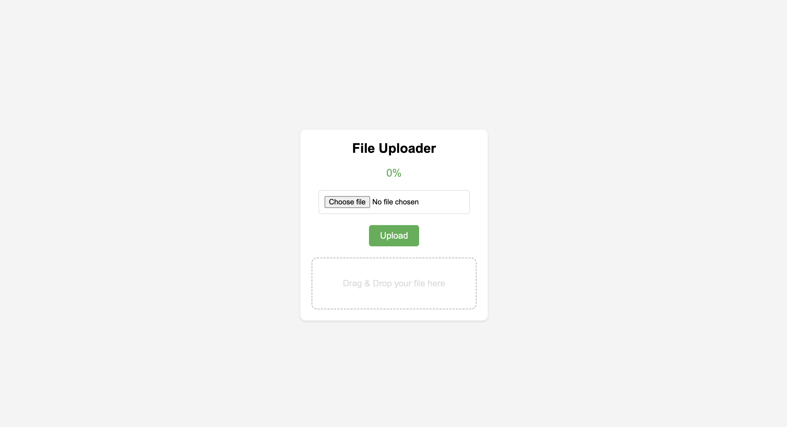

# Web File Uploader

This is a simple web file uploader built using Python and Flask. It includes a secret token mechanism to securely access uploaded files.




## Features
- Upload files to the server
- Securely access uploaded files using a secret token

## Requirements
- Python 3.x
- Flask

## Installation

1. Clone the repository:
    ```bash
    git clone https://github.com/haikal-dev/web-file-uploader.git
    cd web-file-uploader
    ```

2. Install the required packages:
    ```bash
    pip3 install Flask
    ```

3. Create the upload directory if it doesn't exist:
    ```bash
    mkdir -p <WEB_FILE_UPLOADER_DIRECTORY>/files/
    ```

## Usage

1. Run the application:
    ```bash
    ./uploader.py
    ```

2. Open a web browser and navigate to `http://127.0.0.1:5000/`.

3. Use the form to upload a file.

4. The uploaded file will be saved in the `<WEB_FILE_UPLOADER_DIRECTORY>/files/` directory.

5. To access an uploaded file, use the URL format:
    ```
    http://127.0.0.1:5000/d/<hash>/<filename>
    ```
   Replace `<hash>` with the first 8 characters of the SHA-256 hash of the filename and secret key, and `<filename>` with the name of the uploaded file.

## Code Overview

- `generate_hash(filename, secret_key)`: Generates an HMAC-SHA256 hash of the filename using the secret key.
- `uploader()`: Displays the file upload form.
- `upload_file()`: Handles file upload and saves the file to the upload directory.
- `uploaded_file(hashing, filename)`: Serves the uploaded file if the provided hash matches the expected hash.

## Configuration

- `UPLOAD_FOLDER`: The directory where uploaded files are saved.
- `SECRET_KEY`: The secret key used to generate the hash for file access.

## Security Considerations

- Ensure the `SECRET_KEY` is kept secure and not exposed publicly.
- Consider additional security measures such as HTTPS, user authentication, and access control based on your use case.

## License

This project is licensed under the MIT License.
